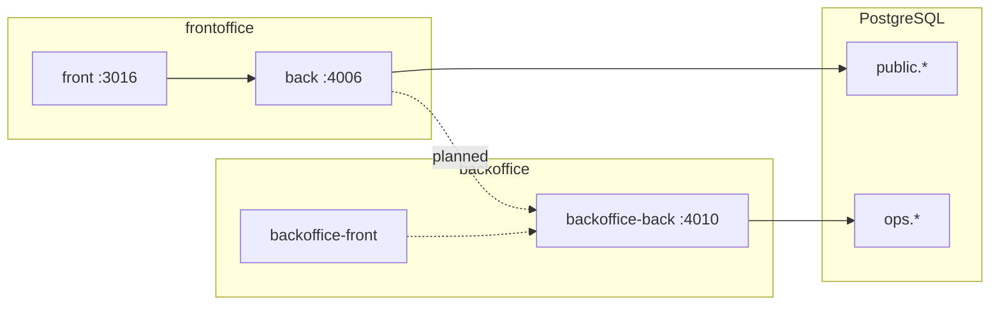

# Monorepo Overview — Smart Scheduler (4 Repos)

> อัปเดต: 2026-06-30 · สำหรับ AI agent ที่มาทำต่อ

---

## 1. โครงสร้าง monorepo

```
smart-scheduler/                    ← workspace root (เอกสารร่วมที่ docs/)
├── docs/                           ← ⭐ ต้นฉบับเอกสารธุรกิจ + living spec
├── chat-requirement-detail.md      ← ข้อความดิบลูกค้า (payroll)
├── S__74989580.jpg                 ← rate card โปรแกรม/ราคา
├── smart-scheduler-back/           ← Scheduling API (Hono :4006)
├── smart-scheduler-front/          ← Staff UI (Next.js :3016)
├── smart-scheduler-backoffice-back/← Operations API (Hono :4010)
└── smart-scheduler-backoffice-front/ ← Admin UI (Next.js :3018 — P&L + Items built)
```

**Database:** PostgreSQL เดียว — `public.*` (scheduling) + `ops.*` (finance)

> **Canonical port map (confirmed by Porter 2026-07-20 — this is the source of truth):**
> staff-front **:3016** · scheduling-back **:4006** · ops-back **:4010** · ops-front **:3018**.
> Cross-service `.env`: `smart-scheduler-back OPS_API_URL=http://localhost:4010`,
> `smart-scheduler-backoffice-front NEXT_PUBLIC_BACKOFFICE_API_URL=http://localhost:4010/api`.
> Scheduled-task targets: **end-of-day → :4006** (`INTERNAL_JOB_SECRET`),
> **month-start → :4010** (`X-Service-Token`). Older `:3001/:3000/:3002/:3100` mentions are superseded.

---

## 2. สรุปแต่ละ repo

### smart-scheduler-back (Scheduling API)

| | |
|--|--|
| **Stack** | Bun, Hono, Drizzle, PostgreSQL (`public`) |
| **Port** | 4006 |
| **บทบาท** | Source of truth: ครู, นักเรียน, จอง, ลา, LINE push |
| **ความสำเร็จ** | ~75% — 17 API endpoints, conflict resolution, recurring course, voucher, JWT |
| **เหลือ** | C.1–C.5 (QR/LINE/CRM/cron), D.1 (wire backoffice) |
| **เริ่มอ่าน** | `CLAUDE.md`, `todo.md`, `src/services/scheduler.service.ts` |

### smart-scheduler-front (Staff Web)

| | |
|--|--|
| **Stack** | Next.js 16, React 19, Mantine v9, TanStack Query |
| **Port** | 3016 |
| **บทบาท** | ปฏิทิน staff แทน Excel — จอง, เช็คอินมือ, รายงาน |
| **ความสำเร็จ** | ~70% — เชื่อม API จริง + auth |
| **เหลือ** | ฟอร์มสมัครคอร์ส/voucher (BE พร้อม), รอ C.* จาก BE |
| **เริ่มอ่าน** | `CLAUDE.md`, `todo.md`, `src/components/partials/Calendar/` |

### smart-scheduler-backoffice-back (Operations API)

| | |
|--|--|
| **Stack** | Bun, Hono, Drizzle, PostgreSQL (`ops`) |
| **Port** | 4010 |
| **บทบาท** | Mini ERP/POS, wallet ชั่วโมง, pricing, settlement (payroll) |
| **ความสำเร็จ** | ~40% — catalog, parties, accounts, commercial, pricing CRUD |
| **เหลือ** | Settlement, reports, wire scheduling debit, seed เรทจริง |
| **เริ่มอ่าน** | `CLAUDE.md`, `docs/requirement.md`, `src/services/` |

### smart-scheduler-backoffice-front (Admin Web)

| | |
|--|--|
| **Stack** | Next 16 + React 19 + Mantine v9 (dark) + TanStack Query · port **3018** |
| **บทบาท** | Admin ERP/การเงิน — แทน Alis To Soft (pivot เป็น **item-centric P&L**) |
| **ความสำเร็จ** | ⚠️ **ไม่ใช่ 0%** — Dashboard P&L + Items (catalog + สต๊อก IN/OUT/ADJUST) ต่อ API จริงแล้ว · หน้า inventory/wallet/payroll/reports ยัง stub |
| **เริ่มอ่าน** | `src/components/partials/{Dashboard,Items}/` · ทิศทาง payroll/wallet = รอ stakeholder (ดู requirement-timeline 2026-07-20) |

---

## 3. Data flow



**Integration ที่ยังไม่ wire:**

- `ATTENDED` → `POST /ops/accounts/:id/debits`
- Scheduling FE → `GET /ops/pricing/rules` (เรท/cap ครู)
- Settlement สิ้นเดือน ← aggregate จาก `bookings` + `commerce/sales`

---

## 4. สถานะฟีเจอร์ตามสัญญา Option C

| ฟีเจอร์ | BE sched | FE sched | BE ops | FE ops |
|---------|----------|----------|--------|--------|
| ปฏิทิน 09–18 | ✅ | ✅ | — | — |
| จอง 4 ประเภท | ✅ | ✅ | — | — |
| Conflict / จองทับ | ✅ | ✅ | — | — |
| กฎลา/ขยาย | ✅ | ✅ | — | — |
| Teacher order | ✅ | ✅ | — | — |
| Freelance income cap | 🟡 mock | 🟡 mock | ✅ rules | ❌ |
| LINE push ครู | 🟡 no userId | toast | ❌ | — |
| LINE OA webhook | ❌ | ❌ | ❌ | ❌ |
| QR check-in | ❌ | ❌ | — | — |
| CRM points | ❌ | ❌ | 🟡 schema | ❌ |
| Cron ตัดโควตาสิ้นวัน | ❌ | — | — | — |
| สมัครคอร์ส API | ✅ | ✅ form | — | — |
| Voucher API | ✅ | ✅ form | — | — |
| Inventory/POS | — | — | ✅ | ❌ |
| Wallet ชั่วโมง | — | — | ✅ | ❌ |
| Payroll settlement | — | — | ❌ | ❌ |

---

## 5. ลำดับงานแนะนำ (2026-06-30)

1. ~~**Master data**~~ — ✅ seed โปรแกรม + ครู (2026-06-30)
2. ~~**FE** ฟอร์มคอร์ส + voucher~~ — ✅
3. **C.4** LINE webhook (ปลดล็อก push จริง)
4. **C.3** cron 18:00 ตัดโควตา
5. **D.1** wire scheduling ↔ backoffice (debit + pricing)
6. **backoffice-front** Wave 0 → inventory demo
7. **Settlement** — payroll 3 ประเภทครูตาม [teacher-roster-payroll.md](teacher-roster-payroll.md)

---

## 6. คำสั่ง dev

```bash
# Scheduling API
cd smart-scheduler-back && bun install && bun run dev    # :4006

# Staff UI
cd smart-scheduler-front && bun install && bun run dev   # :3016

# Operations API
cd smart-scheduler-backoffice-back && bun install && bun run dev  # :4010

# DB migrate (scheduling)
cd smart-scheduler-back && bunx drizzle-kit migrate && bun run db:seed

# DB migrate (ops)
cd smart-scheduler-backoffice-back && bunx drizzle-kit migrate && bun run db:seed
```

**Env:** ดู `.env.example` ในแต่ละ repo · `SKIP_AUTH=true` / `SKIP_ADMIN_AUTH=true` ใน dev

---

## 7. เอกสารที่ต้องอ่านก่อน code

1. [business-domain.md](business-domain.md)
2. [product-catalog-pricing.md](product-catalog-pricing.md)
3. [teacher-roster-payroll.md](teacher-roster-payroll.md)
4. [requirement-timeline.md](requirement-timeline.md) — entry บนสุดชนะ
5. `<repo>/CLAUDE.md` + `<repo>/todo.md`
